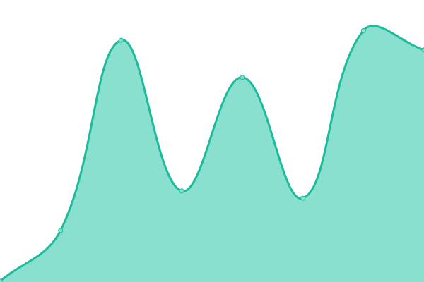

# [📈 Live Status](https://status.generatorlabs.com): <!--live status--> **🟩 All systems operational**

<!--start: status pages-->
<!-- This summary is generated by Upptime (https://github.com/upptime/upptime) -->
<!-- Do not edit this manually, your changes will be overwritten -->
<!-- prettier-ignore -->
| URL | Status | History | Response Time | Uptime |
| --- | ------ | ------- | ------------- | ------ |
|  [rbltracker.com Website](https://rbltracker.com) | 🟩 Up | [rbltracker-com-website.yml](https://github.com/generator-labs/status/commits/HEAD/history/rbltracker-com-website.yml) | 

 239ms
     
 | 

<a href="https://status.generatorlabs.com/history/rbltracker-com-website">100.00%</a>
    

<!--end: status pages-->

[**Visit our status website →**](https://status.generatorlabs.com)

## 📄 License

- Powered by: [Upptime](https://github.com/upptime/upptime)
- Code: [MIT](./LICENSE) © [Anand Chowdhary](https://anandchowdhary.com), supported by [Pabio](https://pabio.com)
- Data in the `./history` directory: [Open Database License](https://opendatacommons.org/licenses/odbl/1-0/)
